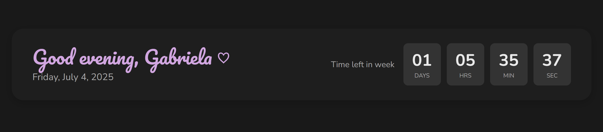

### URL Parameters for the Widget

Example URL:  
https://notion-clock-widget-psi.vercel.app/?lang=pt-br&name=Gabriela

markdown
Copy
Edit

- **`lang`**: Sets the language of the widget. Available options:  
  - `pt-br` — Brazilian Portuguese (week starts on Sunday)  
  - `en-us` — English (US) (week starts on Sunday)  
  - `en-gb` — English (UK) (week starts on Monday)  
  - `es` — Spanish (Spain) (week starts on Monday)  
  - `es-mx` — Spanish (Mexico) (week starts on Sunday)  
  - `fr` — French (week starts on Monday)  
  - `de` — German (week starts on Monday)  
  - `it` — Italian (week starts on Monday)  
  - `ja` — Japanese (week starts on Sunday)

> **Note:** The first day of the week is set according to the locale of the selected language.

- **`name`**: Sets the name displayed on the widget.  
  - Example: `Gabriela`.